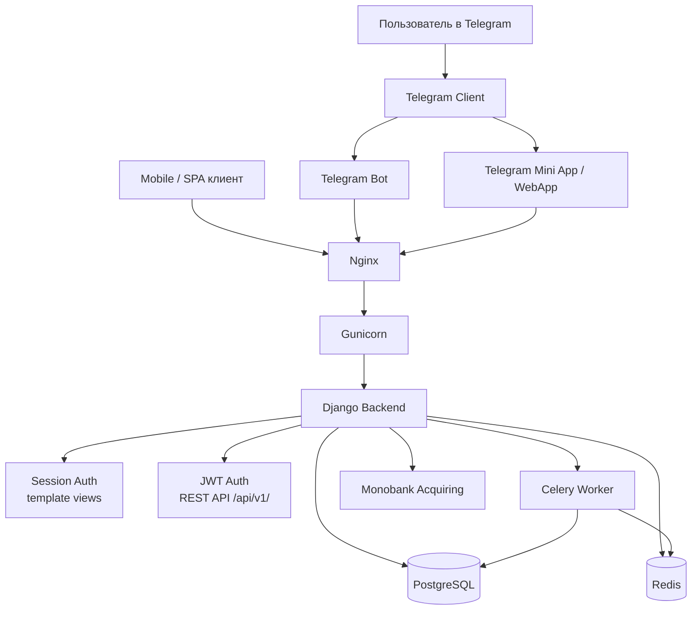
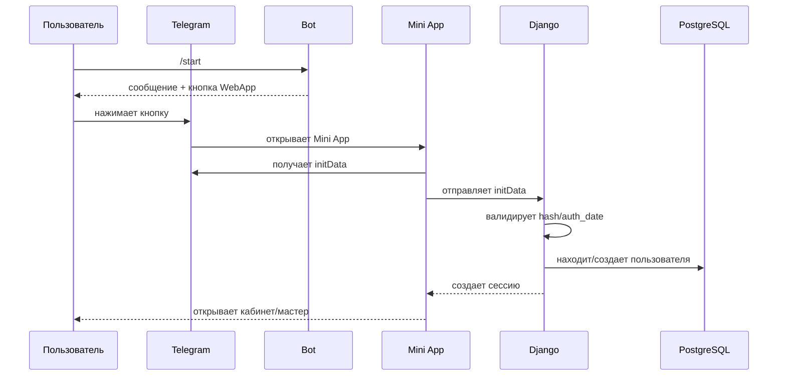

# AI_ARCHITECTURE_MAP.md — robochi_bot

## Назначение

Этот файл нужен, чтобы AI-агенты быстро понимали архитектуру проекта `robochi_bot` на верхнем уровне:
- какие основные компоненты есть
- как они связаны между собой
- где проходит пользовательский путь
- какие зоны критичны для продакшена

---

## 1. Общая схема системы

---

## 2. Главные компоненты

### 2.1 Telegram Bot
Отвечает за:
- запуск сценариев через `/start`
- отправку кнопок
- открытие Mini App
- сбор Telegram-событий через webhook

### 2.2 Telegram Mini App
Отвечает за:
- интерфейс внутри Telegram
- получение `initData`
- запуск пользовательского сценария внутри WebApp
- передачу `initData` на backend

### 2.3 Django Backend
Отвечает за:
- бизнес-логику
- шаблоны и страницы
- аутентификацию
- работу с базой данных
- проверку Telegram `initData`

### 2.4 PostgreSQL
Хранит:
- пользователей
- вакансии
- отклики
- служебные сущности проекта

### 2.5 Redis
Используется как:
- broker для Celery
- вспомогательный слой для фоновых задач

### 2.6 Celery
Отвечает за:
- фоновые задачи
- отложенные операции
- тяжелые действия, которые не стоит выполнять в HTTP-запросе

### 2.7 Gunicorn + Nginx + systemd
Отвечают за:
- прием HTTP-запросов
- запуск Django
- обслуживание продакшена
- управление сервисами

---

## 3. Критический пользовательский путь

---

## 4. Самые важные точки риска

### 4.1 Telegram initData
Это одна из самых важных зон безопасности.

Нельзя:
- доверять `initDataUnsafe`
- принимать Telegram identity только на клиенте
- пропускать серверную проверку подписи

Нужно:
- валидировать `hash`
- проверять `auth_date`
- использовать bot token на сервере

### 4.2 Production-конфиг
Осторожно изменять:
- `.env`
- systemd unit-файлы
- настройки Nginx
- cookie/security settings

### 4.3 Celery
Осторожно изменять:
- периодические задачи
- тяжелые фоновые операции
- код, который может дублироваться при retry

---

## 5. Архитектурные зоны проекта

### Зона 1 — Telegram layer
Что входит:
- bot handlers
- webhook endpoints
- WebApp launch logic

### Зона 2 — Web layer
Что входит:
- Django views
- templates
- forms
- session/auth (для Mini App)

### Зона 3 — API layer (добавлена 16.03.2026)
Что входит:
- DRF views и serializers (api/ app)
- JWT authentication (SimpleJWT)
- REST endpoints /api/v1/
- Swagger/OpenAPI docs

### Зона 4 — Data layer
Что входит:
- models
- migrations
- PostgreSQL
- AuthIdentity (multi-provider auth)

### Зона 5 — Async layer
Что входит:
- Celery tasks
- Redis
- periodic jobs

### Зона 6 — Payment layer (добавлена 16.03.2026)
Что входит:
- payment/ app
- MonobankPayment model
- payment/services.py
- Monobank webhook (ECDSA verification)
- Telegram Payments удалены

### Зона 7 — Infra layer
Что входит:
- Gunicorn
- Nginx
- systemd
- deployment scripts

---

## 6. Что AI должен понимать перед изменениями

Перед любым изменением AI обязан определить:

1. Какая зона затрагивается:
   - Telegram
   - Django
   - DB
   - Celery
   - Infra

2. Нужен ли restart:
   - gunicorn
   - celery-worker
   - celery-beat

3. Нужна ли миграция:
   - да / нет

4. Есть ли риск для production:
   - высокий / средний / низкий

---

## 7. Правило для AI

Если изменение затрагивает:
- Python backend → почти всегда нужен `gunicorn restart`
- Celery tasks → нужен restart worker/beat
- models → нужны migrations
- Telegram auth / WebApp → нужна ручная проверка пользовательского пути
