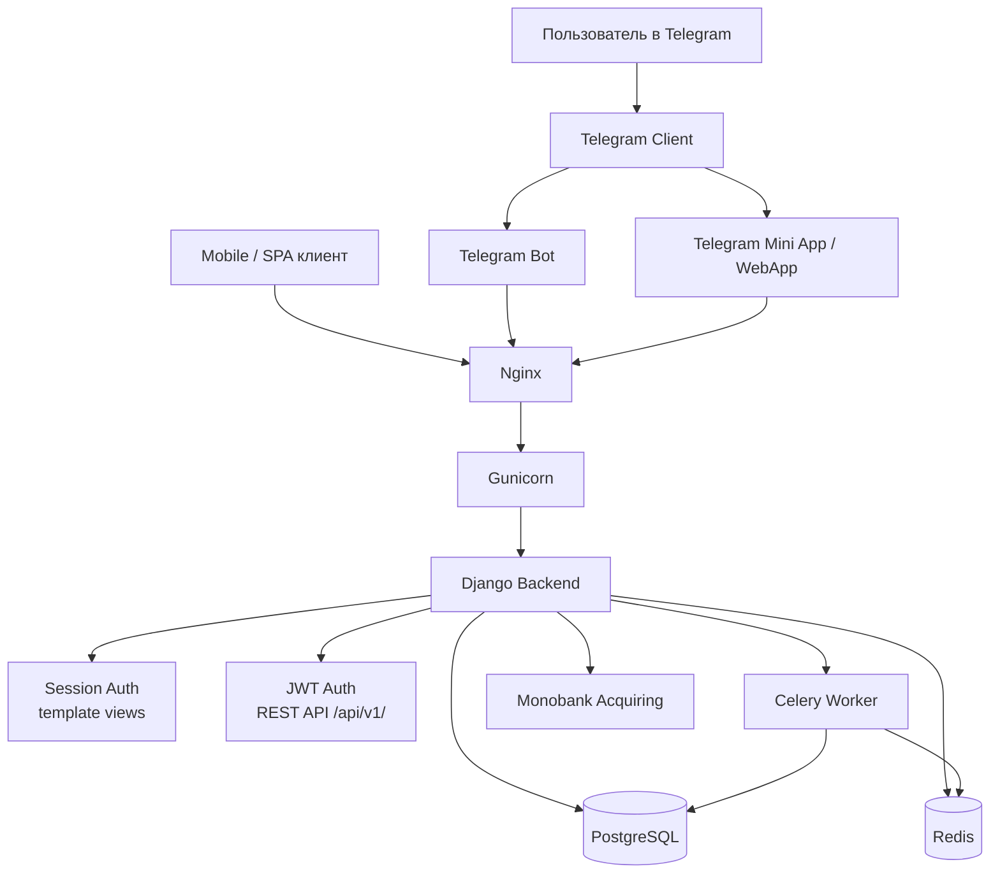
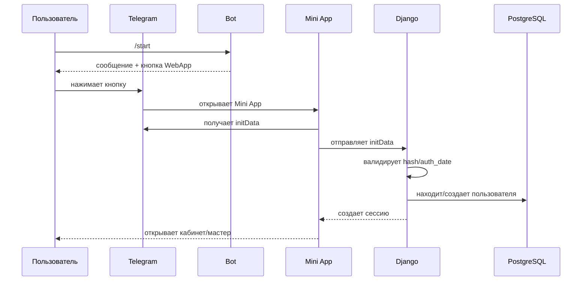

# ARCHITECTURE.md --- robochi_bot System Architecture

Last updated: 25.03.2026

## Overview

robochi_bot is a Telegram-based platform connecting employers and workers.

System architecture:

```
Telegram Client
    |
    v
Telegram Bot (pyTelegramBotAPI)      Telegram Mini App (WebApp)
    |                                       |
    v                                       v
                    Nginx
                      |
                      v
                  Gunicorn
                      |
                      v
               Django Backend
              /       |       \
     Session Auth   JWT Auth   REST API (DRF)
              \       |       /
               PostgreSQL
                      |
               Redis (Celery broker)
                      |
               Celery Workers
```

## Components

### Telegram Bot
Handles:
- /start command
- user interaction
- WebApp buttons
- contact sharing (phone number)
- webhook at /telegram/webhook-{SECRET}/

### Telegram Mini App
Handles:
- interface inside Telegram
- obtains initData from Telegram.WebApp
- sends initData to backend for authentication
- renders wizard, dashboard, vacancy forms

### Django Backend (two parallel auth mechanisms)

**Session Auth (existing)** — for Mini App:
- /telegram/authenticate-web-app/ validates HMAC-SHA256 initData
- Creates Django session
- Used by all template views

**JWT Auth (new, added 16.03.2026)** — for REST API:
- /api/v1/auth/telegram/ validates initData, returns access+refresh tokens
- Used by mobile clients and SPA frontends
- Implemented with SimpleJWT

### REST API (added 16.03.2026)
Django REST Framework application (api/).
- No models, no migrations
- Business logic stays in services.py of each app
- Endpoints under /api/v1/
- Swagger UI at /api/docs/

### Payment Integration (updated 16.03.2026)
- Telegram Payments: REMOVED
- Monobank Acquiring: active (payment/ app)
  - MonobankPayment model
  - Webhook at /api/v1/payments/webhook/monobank/ (ECDSA verified)
  - Merchant token (MONOBANK_API_TOKEN) not yet configured

### AuthIdentity (added 16.03.2026)
Model in user/models.py linking User to auth providers:
- Providers: telegram, phone, email, google
- Enables future Android/iOS auth without Telegram

### Celery
Runs background tasks:
- vacancy call-checks (before_start, start, final, after_first)
- close_vacancy (2h after end)
- resend_vacancies_to_channel (rotation, every 5 min)
- test_heartbeat

### Redis
Message broker for Celery (redis://localhost:6379/0).

### PostgreSQL
Main database.

### Nginx + Gunicorn
Nginx receives HTTP traffic. Gunicorn runs Django (unix socket, 1 worker).

## Telegram Mini App Flow

1. User clicks WebApp button
2. Telegram opens web page
3. telegram-web-app.js loads
4. initData injected
5. initData sent to backend
6. Backend verifies HMAC signature
7. User logged in via Django session OR JWT token

Reference:
https://core.telegram.org/bots/webapps

## Architectural Zones

Zone 1 — Telegram layer: bot handlers, webhook, WebApp launch
Zone 2 — Web layer: Django views, templates, forms, session auth
Zone 3 — API layer: DRF views, serializers, JWT auth (new)
Zone 4 — Data layer: models, migrations, PostgreSQL
Zone 5 — Async layer: Celery tasks, Redis, periodic jobs
Zone 6 — Payment layer: Monobank Acquiring (payment/ app)
Zone 7 — Infra layer: Gunicorn, Nginx, systemd, deployment

## ЛК Администратора (добавлено 25.03.2026)

### Маршрутизация index.py
`work/views/index.py` — точка входа после аутентификации, распределяет по роли:
```
authenticate_web_app → /work/
    ├── user.is_staff = True  → redirect work:admin_dashboard
    ├── Employer, 0 вакансий  → redirect vacancy:create
    ├── Employer              → render employer_dashboard.html
    └── Worker                → render worker_dashboard.html
```

### ЛК Администратора (work/views/admin_panel.py)
- `admin_dashboard` — дашборд с двумя табами: Користувачі / Вакансії + карта вакансий по статусам
- `admin_search_users` — AJAX-поиск пользователей (GET ?q=)
- `admin_search_vacancies` — AJAX-поиск вакансий (GET ?q=)
- `admin_vacancy_card` — детальный просмотр вакансии (GET)
- `admin_block_user` — блокировка/разблокировка пользователя (POST)
- `admin_moderate_vacancy` — форма модерации вакансии: approve/reject (GET+POST)

URL namespace: `work:admin_dashboard`, `work:admin_search_users`, и т.д.
Доступ: `user.is_staff == True` — декоратор/проверка в каждом view.

### Модерация вакансий
Кнопка в боте (telegram_markup_factory.admin_vacancy_reply_markup) открывает Mini App:
```
Бот → кнопка "Модерувати" → /work/admin-panel/vacancy/<id>/moderate/
                                        ↓
                              admin_moderate_vacancy (GET)
                                        ↓
                              Форма approve/reject (POST)
                                        ↓
                              vacancy.status updated → уведомление работодателю
```
НЕ используется Django admin (`/admin/vacancy/vacancy/<id>/change/`) — это устаревший путь.

## Localization / i18n (added 19.03.2026)

Zone 8 — i18n layer:
- Django i18n: USE_I18N=True, LANGUAGE_CODE='uk', LANGUAGES=[uk, ru]
- django-parler: TranslatableModel for City (and future content models)
- UserLanguageMiddleware: activates translation per user.language_code
- locale/uk/, locale/ru/ — .po/.mo translation files
- Telegram Bot: setMyCommands per language_code (uk, ru, default)
- setup_bot_commands() in telegram/handlers/set_commands.py

Translation flow:
```
User.language_code → UserLanguageMiddleware → translation.activate(lang)
                                                    ↓
                                          Django renders translated text
                                          (templates: , Python: _())
```

## System Diagram (Mermaid)



## Critical User Path (Mermaid)



## Risk Zones

### initData — security critical
- ❌ Do NOT trust initDataUnsafe
- ❌ Do NOT accept Telegram identity only on client
- ❌ Do NOT skip server signature verification
- ✅ Validate hash (HMAC-SHA256)
- ✅ Check auth_date (7200s expiry)
- ✅ Use bot token server-side only

### Production config — change carefully
- .env
- systemd unit files
- Nginx settings
- cookie/security settings

### Celery — change carefully
- periodic tasks
- heavy background operations
- code that may duplicate on retry

## What AI Must Check Before Changes

1. Which zone is affected: Telegram / Django / DB / Celery / Infra
2. Restart needed? gunicorn / celery-worker / celery-beat
3. Migration needed? yes / no
4. Production risk level? high / medium / low

## Rule for AI

- Python backend change → almost always gunicorn restart
- Celery tasks change → restart worker/beat
- models change → migrations required
- Telegram auth / WebApp change → manual test of user path
