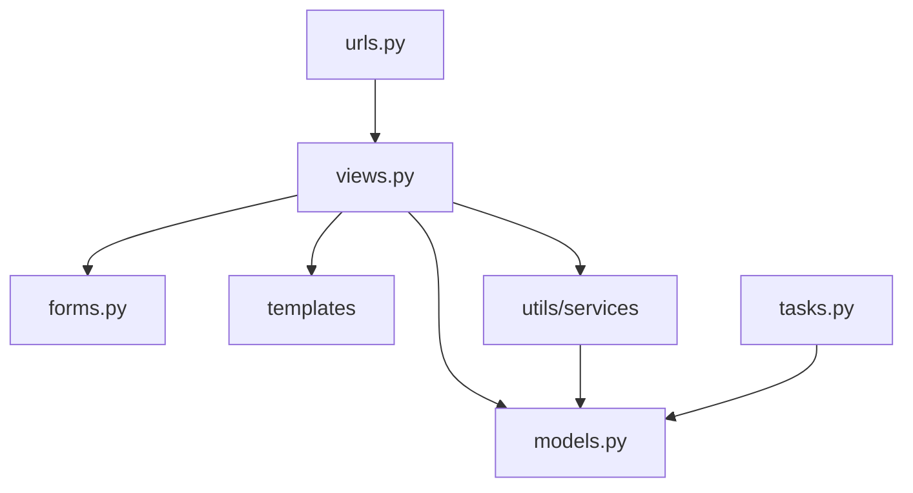

# DJANGO_CODE_MAP.md — robochi_bot

## Назначение

Этот файл нужен, чтобы AI-агенты понимали, где в Django-проекте обычно искать нужную логику и что именно менять.

Это не абсолютная карта каждого файла, а **рабочая карта мышления для AI**.

---

## 1. Как AI должен искать изменения

При любой задаче AI сначала определяет тип изменения:

- backend logic
- models / database
- templates / frontend
- Telegram auth / Mini App
- background tasks
- infra / deploy

После этого AI выбирает зону поиска.

---

## 2. Где обычно искать по типу задачи

### 2.1 Если меняется логика страницы
Смотреть:
- `views.py`
- `urls.py`
- `templates/...`

### 2.2 Если меняется структура данных
Смотреть:
- `models.py`
- `admin.py`
- `forms.py`
- `migrations/`

### 2.3 Если меняется поведение Mini App
Смотреть:
- Telegram-related views
- templates Mini App
- JS в static/templates
- auth helpers / utils

### 2.4 Если меняется логика бота
Смотреть:
- bot handlers
- webhook view
- utils для Telegram

### 2.5 Если меняются фоновые задачи
Смотреть:
- `tasks.py`
- celery configuration
- periodic scheduling

### 2.6 Если меняется deploy / runtime
Смотреть:
- deploy scripts
- systemd config
- env
- nginx / gunicorn related files

---

## 3. Логические слои Django-проекта

---

## 4. Карта типичных файлов

### urls.py
Нужен, если:
- добавляется новый endpoint
- меняется маршрут
- меняется webhook path
- добавляется новый flow Mini App

### views.py
Нужен, если:
- меняется логика обработки запросов
- меняется auth flow
- меняется редирект
- меняется ответ страницы/API

### models.py
Нужен, если:
- добавляются новые поля
- меняются сущности
- меняется связь между сущностями

### forms.py
Нужен, если:
- меняются формы
- добавляется валидация пользовательского ввода
- меняется wizard flow

### admin.py
Нужен, если:
- нужно показать данные в Django admin
- нужно улучшить управление сущностями

### templates/
Нужны, если:
- меняется HTML
- меняется UI
- меняется Telegram Mini App frontend слой

### static/
Нужны, если:
- меняется CSS
- меняется JS
- меняется поведение браузерной части

### tasks.py
Нужен, если:
- операция должна идти в фоне
- есть отправка уведомлений
- есть scheduled jobs

### utils.py / services.py
Нужны, если:
- повторяющаяся логика должна быть вынесена
- есть интеграция с Telegram
- есть проверка initData
- есть хелперы для auth

---

## 5. Как AI должен предлагать изменения

AI должен предлагать изменения точечно:

### Правильный формат
- что меняем
- зачем меняем
- в каком файле
- какие команды выполнить
- нужен ли restart
- нужна ли миграция

### Неправильный формат
- переписывать весь проект
- давать гигантский код без привязки к месту
- менять unrelated файлы без объяснения

---

## 6. Чеклист перед изменением Django-кода

Перед изменением AI должен ответить себе:

1. Это влияет на URL?
2. Это влияет на view?
3. Это влияет на model?
4. Это влияет на template?
5. Это влияет на auth?
6. Это влияет на Telegram flow?
7. Это требует migration?
8. Это требует restart gunicorn?
9. Это требует restart celery?

---

## 7. Чеклист после изменения

После изменения AI должен рекомендовать:

### Если менялся Python backend
- `python3 manage.py check`
- restart gunicorn

### Если менялись models
- `python3 manage.py makemigrations`
- `python3 manage.py migrate`

### Если менялись templates/static
- проверить UI вручную
- при необходимости `collectstatic`

### Если менялся Telegram flow
- ручной тест `/start -> WebApp -> auth`

### Если менялись Celery tasks
- restart celery-worker
- restart celery-beat

---

## 8. Правило для AI

Если структура проекта не до конца известна, AI не должен выдумывать точные пути.

Нужно:
- явно отмечать предположение
- привязываться к уже известным файлам
- работать от текущего контекста проекта
