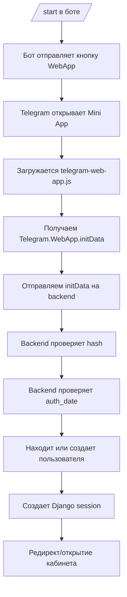
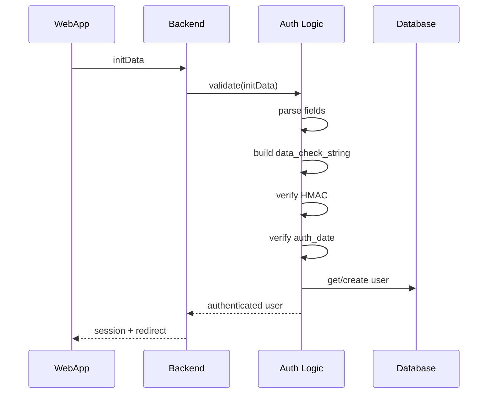

# TELEGRAM_MINIAPP_FLOW.md — robochi_bot

## Назначение

Этот файл описывает, как именно в проекте работает Telegram Mini App:
- запуск из бота
- передача `initData`
- серверная авторизация
- типичные ошибки
- что должен проверять AI

---

## 1. Базовый сценарий

Пользователь:
1. открывает бота
2. получает сообщение с кнопкой Mini App
3. нажимает кнопку
4. Telegram открывает WebApp
5. Mini App получает `Telegram.WebApp.initData`
6. backend валидирует подпись
7. Django логинит пользователя
8. пользователь попадает в нужный экран

---

## 2. Flow запуска

---

## 3. Что такое initData

`initData` — это строка, которую Telegram передает Mini App.

Она содержит:
- данные о пользователе
- служебные поля
- `auth_date`
- `hash`

### Важно
AI должен помнить:
- `initData` доверять нельзя, пока backend не проверил подпись
- `initDataUnsafe` нельзя использовать как источник доверенной идентификации

---

## 4. Что должен делать backend

Backend обязан:

1. Принять `initData`
2. Распарсить параметры
3. Удалить `hash` из набора для проверки
4. Собрать `data_check_string`
5. Вычислить HMAC по правилам Telegram
6. Сравнить вычисленный hash и присланный hash
7. Проверить свежесть `auth_date`
8. Только после этого аутентифицировать пользователя

---

## 5. Серверный auth flow

---

## 6. Типичные ошибки

### Ошибка 1. WebApp открывается, но пользователь не логинится
Возможные причины:
- `initData` не передается на backend
- backend не валидирует `hash`
- неправильный bot token
- время `auth_date` просрочено

### Ошибка 2. Пользователь логинится, но сессия не держится
Возможные причины:
- проблема с cookies
- `Secure` / `SameSite=None` настроены неправильно
- проблема с HTTPS / reverse proxy

### Ошибка 3. В браузере работает, а в Telegram нет
Возможные причины:
- тестирование идет не внутри Telegram
- `telegram-web-app.js` не загружен
- Mini App зависит от Telegram context

### Ошибка 4. После релиза Mini App ведет себя по-старому
Возможные причины:
- фронтенд-файлы не попали в git
- static не пересобраны
- не выполнен deploy

---

## 7. Что AI должен проверять при изменениях Mini App

Если задача касается Telegram Mini App, AI обязан проверить:

### Frontend
- подключен ли `telegram-web-app.js`
- читается ли `Telegram.WebApp.initData`
- правильно ли отправляется `initData` на backend
- нет ли доверия к `initDataUnsafe`

### Backend
- есть ли валидация hash
- есть ли проверка `auth_date`
- используется ли bot token с сервера
- создается ли Django session

### Infra
- работает ли HTTPS
- корректны ли cookie settings
- нужен ли restart gunicorn

---

## 8. Smoke test для Mini App

После изменений AI должен рекомендовать проверить такой путь:

1. Открыть бота
2. Выполнить `/start`
3. Нажать кнопку WebApp
4. Убедиться, что Mini App открывается
5. Убедиться, что пользователь не попадает на login/admin
6. Убедиться, что сессия держится после переходов

---

## 9. Правило для AI

Если задача связана с Mini App, AI не должен давать только frontend-решение.

Нужно смотреть сразу на 3 слоя:
- Telegram
- Django backend
- production cookies / HTTPS / proxy
